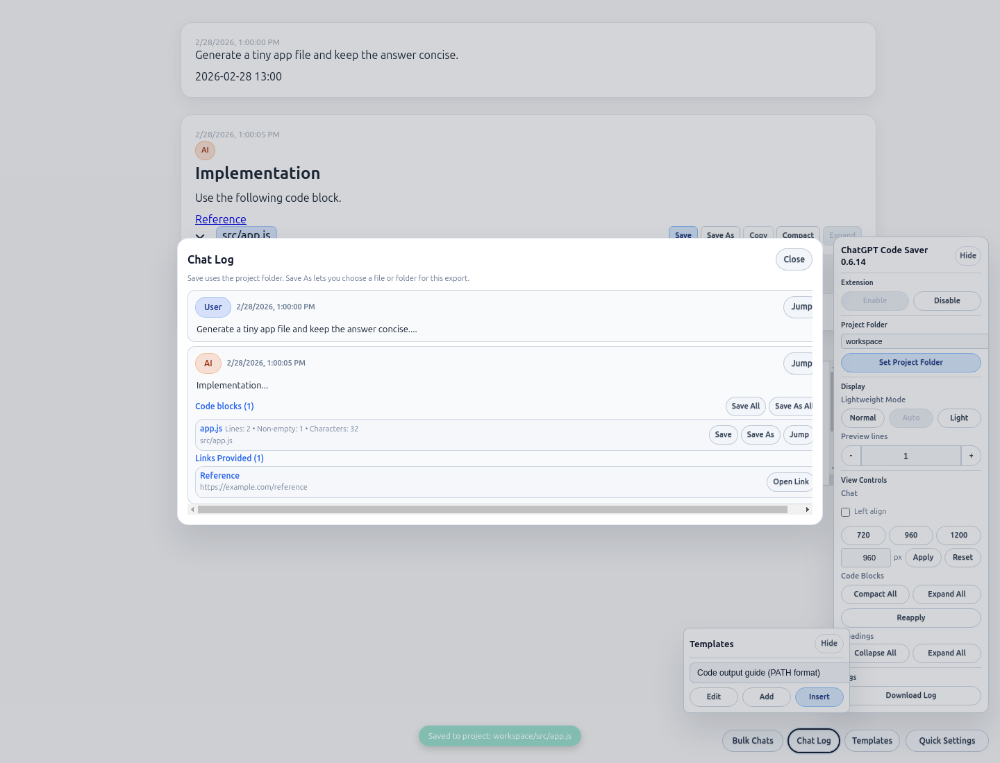
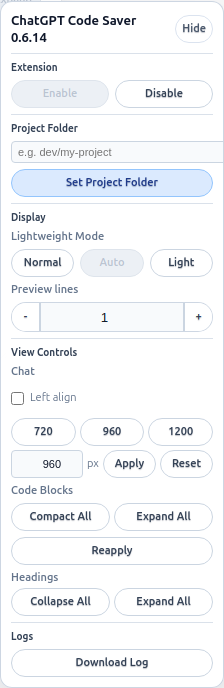
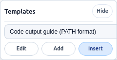
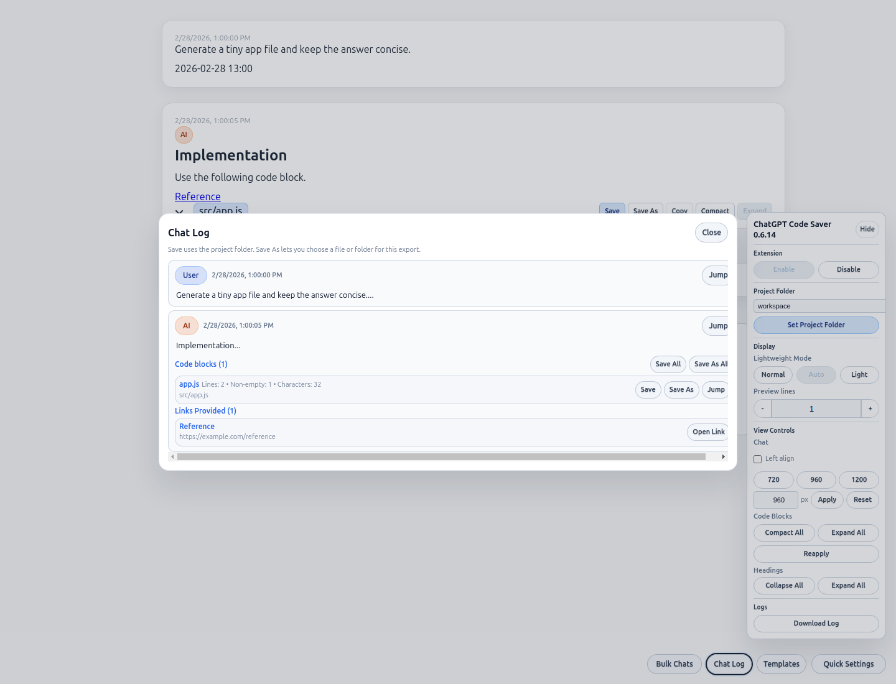
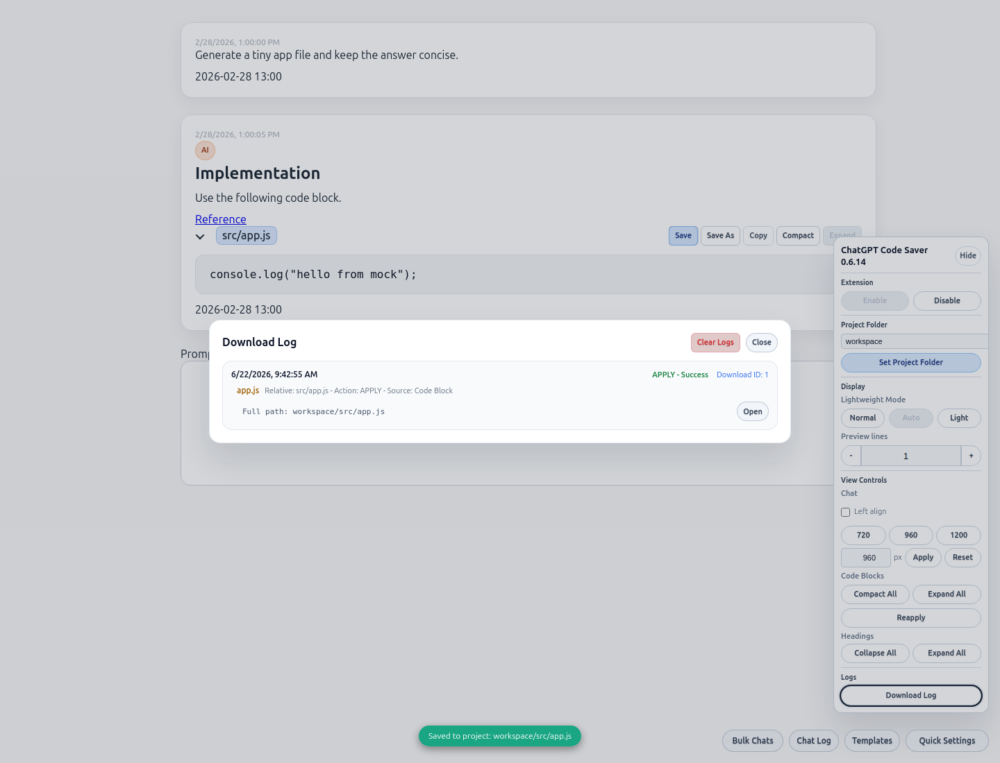
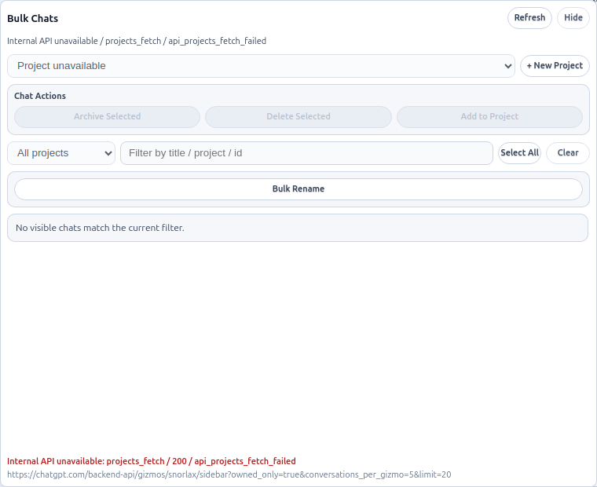

# ChatGPT Code Saver

ChatGPT 上のコードブロックやチャット内容を、ローカルの project folder に保存しやすくする Chrome 拡張です。
コード保存だけでなく、テンプレート挿入、チャットログ一覧、Download Log 確認、左ペイン会話の一括操作にも対応しています。

内部実装や設計メモは [DEVELOPERS.md](DEVELOPERS.md) にまとめています。利用方法だけを知りたい場合は、この README を参照してください。

## できること

- コードブロック直前の `PATH: path/to/file.ext` を読み取り、`Save` で project folder 配下へ保存
- `PATH:` が無いコードブロックでも、生成ファイル名で `Save` / `Save As` を続けられる
- `Save As` / `Save All` / `Save As All` による個別保存・一括保存
- `Templates` パネルからのテンプレート挿入、追加、編集
- `Chat Log` モーダルで発話、見出し、コードブロック、リンクを一覧表示
- `Download Log` モーダルで保存結果、保存先、action、source を確認
- `Bulk Chats` パネルで ChatGPT internal API から会話一覧と Project 一覧を取得し、検索・選択・一括アーカイブ、削除、Project 登録
- `Quick Settings`、`Templates`、`Chat Log`、`Bulk Chats` の独立 launcher
- `Lightweight Mode`、`Preview lines`、チャット幅、`Compact All` / `Expand All`、heading fold による表示量の調整

## 画面イメージ

### README ワークフロー

README の説明に対応する代表的な画面です。コード保存、テンプレート挿入、チャットログ、右下 launcher 群をまとめて確認できます。



### メインパネル

`Quick Settings` から開くメインパネルです。`Extension`、`Project Folder`、`Display`、`View Controls`、`Logs` をまとめています。



### Templates パネル

独立した `Templates` ボタンから開き、テンプレートの選択、追加、編集、挿入を行えます。



### Chat Log

独立した `Chat Log` ボタンから開きます。発話要約、コードブロック、リンクをモーダルで確認できます。



### Download Log

保存後の履歴を確認できます。保存先、action、source をあとから追えます。



### Bulk Chats

`Bulk Chats` は internal API ベースの独立パネルです。オフライン capture では unavailable 状態を表示しますが、実運用では会話一覧と Project 一覧をここから扱います。



## インストール

1. このリポジトリを `git clone` するか、ZIP で取得します。
2. Chrome で `chrome://extensions/` を開き、右上の `デベロッパーモード` をオンにします。
3. `パッケージ化されていない拡張機能を読み込む` を選び、このリポジトリの `extension/` ディレクトリを指定します。
4. `https://chatgpt.com/` または `https://chat.openai.com/` を開くと、右下に launcher 群と設定パネルが表示されます。

ビルドは不要です。`extension/` 配下をそのまま読み込みます。

## 使い方

### 1. コードブロックを保存する

1. ChatGPT の回答で、各コードブロックの直前に `PATH: src/app.js` のような相対パスを 1 行で含めると、保存先候補として使われます。
2. コードブロック上の `Save` を押すと、設定済み project folder 配下へ保存します。
3. `PATH:` が無い場合でも、生成ファイル名で `Save` / `Save As` を使えます。
4. 複数ブロックをまとめて保存したい場合は `Save All` / `Save As All` を使います。

### 2. project folder を設定する

1. 右下の `Quick Settings` から開くパネルで `Set Project Folder` を押して保存先の基準ディレクトリを設定します。
2. `Lightweight Mode`、`Preview lines`、チャット幅 presets、`Compact All` / `Expand All`、heading controls で表示量を調整できます。
3. `Reapply` を押すと、コード装飾と heading fold を再適用できます。

### 3. テンプレートを使う

1. `Templates` を開いてテンプレートを選択します。
2. `Insert` でチャット入力欄へ挿入します。
3. `PATH:` 形式の複数ファイル向けテンプレートも含めて、`Add` と `Edit` でテンプレートを管理できます。

### 4. チャットログと保存履歴を確認する

1. `Chat Log` では発話、見出し、コードブロック、リンクを一覧できます。
2. `Chat Log` 内のコードブロックにも `Save` / `Save As` / `Save All` / `Save As All` を使えます。
3. `Download Log` では保存結果、保存先、action、source を確認できます。

### 5. 左ペインの会話をまとめて操作する

1. 右下の `Bulk Chats` を開くと、ChatGPT internal API から会話一覧と Project 一覧を読み込みます。
2. タイトル検索で絞り込みながらチェックを付けられます。検索を切り替えても選択は保持されます。
3. `Select Visible` は現在の検索結果だけを追加選択し、`Clear` は全選択を解除します。
4. 選択した会話に対して `Archive Selected`、`Delete Selected`、`Add to Project` を実行できます。
5. Project 配下の会話は対象外として除外されます。

制約:

- 会話一覧と Project 一覧の取得は internal API 依存です。取得に失敗した場合は hard fail します。
- internal API が使えない状態では、Bulk Chats パネルに unavailable / diagnostic 情報が表示されます。
- 一括操作自体は引き続き UI 操作ベースです。API で一覧取得できても DOM に無い会話は `skipped_missing_dom` になることがあります。

## 権限とプライバシー

- 使用している権限は `chrome.storage`, `chrome.downloads`, `downloads.open`, `activeTab`, `tabs`, `scripting` です。
- テンプレートとログは Chrome 拡張のストレージに保存されます。
- コードやチャット本文はローカル保存のためにのみ扱います。
- 外部サーバーへ送信する同期機能はありません。

## テスト

```bash
npm test
```

主なテストコマンド:

- `npm run test:unit`
- `npm run test:e2e`
- `npm run test:e2e:ui`
- `npm run test:e2e:live`

## 関連ドキュメント

- 開発者向けメモ: [DEVELOPERS.md](DEVELOPERS.md)
- 補足ドキュメント: [docs/misc](docs/misc)
